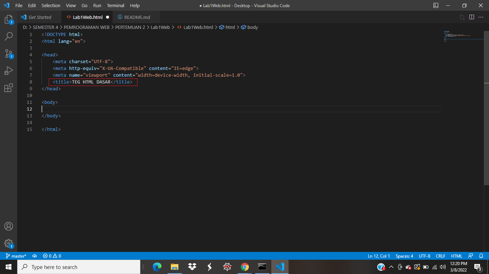
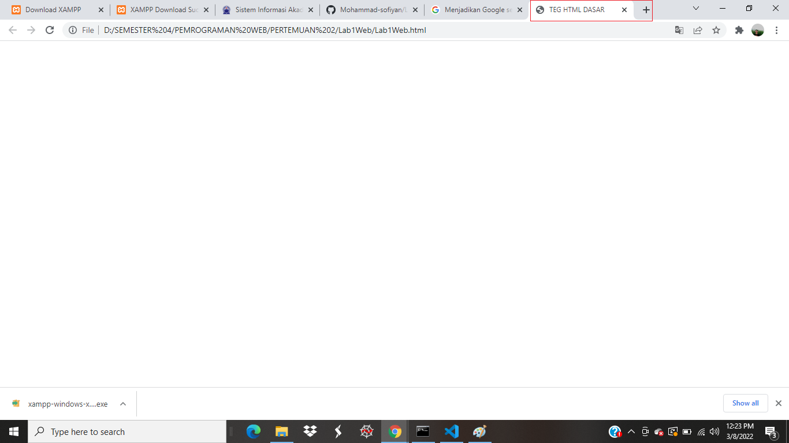

# Lab1web

## Belajar dasar - dasar HTML

### HTML (HyperTex Markup Language) adalah suatu bahasa yang menggunakan tanda-tanda tertentu (tag) untuk menyatakan kode-kode yang harus ditafsirkan oleh browser agar halaman tersebut dapat ditampilkan secara benar.

# Membuat Repository

## 1.Membuat Tag HTML dasar

# 2. Membuat 2 paragraf menggunakan tag 
 

[2_2.png](gambar/2_2.png) 
## Maka akan tampil sebagai berikut 
[2.png](gambar/2.png)

# 3. kemudian mengatur atribut paragraf dengan mengunakan atribut aling 
[3_3.png](gambar/3_3.png)
[3.png](gambar/3.png)
## atribut aling = "right" - > mengatur paragraf di posisi kanan 
## atribut aling = "center" - > mengatur paragraf di posisi tengah 
## atribut aling ="left" - > mengatur paragraf di posisi kiri 

# 4. Membuat Judul Halaman menggunakan tag h1 dan h2
[4_4.png](gambar/4_4.png)
## Maka akan tampil sebagaiberikut... 
[4.png](gambar/4.png)

### Teg Heading 

* Heading merupakan sebuah judul yang biasanya digunakan pada sebuah halaman artikel pada web. Atau terkadang dibeberapa bagian dari halaman web.Judul atau heading pada dokumen HTML dapat dibuat dengan menggunakan tag <h1> sampai <h6>.Tag <h1> merupakan judul pada lever pertama, kemudian level berikutnya atau sub judul pada tag<h2> dan seterusnya sampai tag <h6>.

`<h1>Heading 1</h1>
`<h2>Heading 2</h2>
`<h3>Heading 3</h3>
`<h4>Heading 4</h4>
`<h5>Heading 5</h5>
`<h6>Heading 6</h6>

# 5. contih pemformatan teks
## 5_5png.
